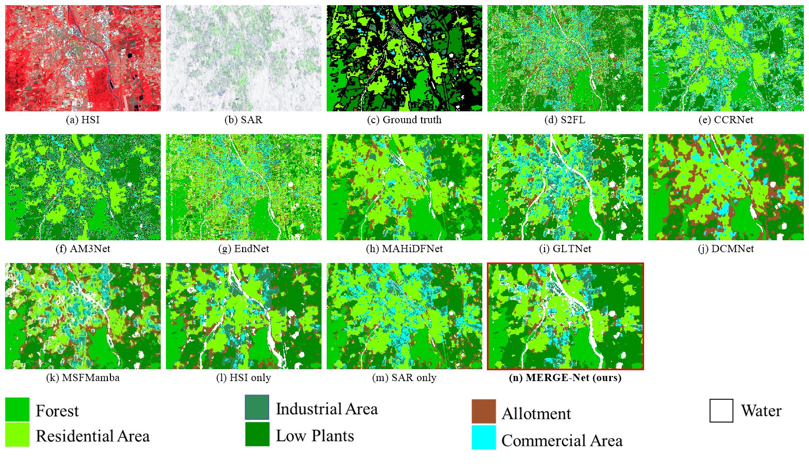
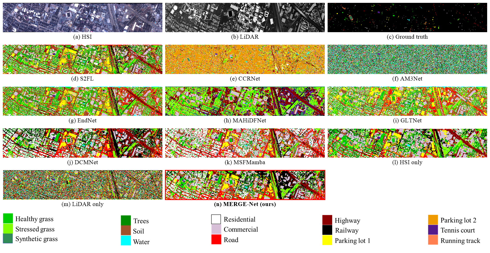
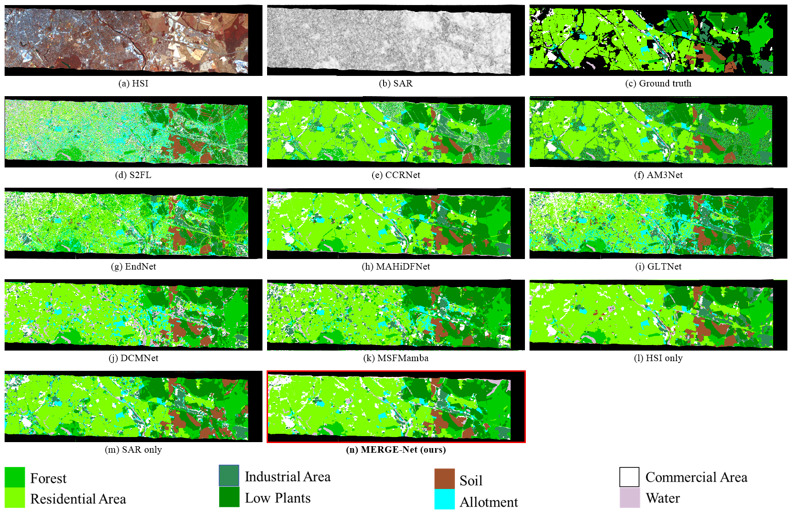

<div align="center">

<h1>Exploring Directional Sparsity and Cross-Modal Contrast-Consensus: MERGE-Net for HSI-SAR/LiDAR Joint Classification</h1>

<h2><em>IEEE Transactions on Geoscience and Remote Sensing (TGRS)</em></h2>


[Jiaqi Yang](https://jqyang22.github.io/)<sup>a</sup>, [Bo Du](https://cs.whu.edu.cn/info/1019/2892.htm/)<sup>b</sup>, [Rong Liu](https://gp.sysu.edu.cn/teacher/3702/)<sup>c</sup>, [Jiayang Huang]()<sup>c</sup>, [Shizhen Chang](https://shizhenchang.github.io/)<sup>d</sup>, [Liangpei Zhang](https://www.zhangliangpei.cn/)<sup>b</sup>

<sup>a</sup> University of Wisconsin-Madison,
<sup>b</sup> Wuhan University,
<sup>c</sup> Sun Yat-sen University, 
<sup>d</sup> Linköping University.

</div>

<div align="center">

<p align='center'>
  <a href="https://ieeexplore-ieee-org.ezproxy.library.wisc.edu/document/11494135"></a>
</p>

<p align="center">
  <a href="#-overview">Overview</a> |
  <a href="#-datasets">Datasets</a> |
  <a href="#-requirements">Requirements</a> |
  <a href="#-usage">Usage</a> |
  <a href="#-results">Results</a> |
  <a href="#-citation">Citation</a>
</p>


</div>


# 🧩 Overview

Multimodal satellite imagery can provide more comprehensive information, which shows a new perspective for observing Earth’s surface. Particularly, the joint use of hyperspectral image (HSI), synthetic aperture radar (SAR), or light detection and ranging (LiDAR) have gained widespread attention due to the concurrent acquisition of spectral-spatial information, structural information or ground elevation. However, most of existing works do not explicitly learn effective intra- and inter-modal mutual information. This induces information redundancy and curtails feature diversity, stalling performance advances across heterogeneous modalities. To address the above challenge, a unified Mutual lEaRning with Geometric Equilibrium network (MERGE-Net) is proposed for HSI-SAR/LiDAR collaborative classification. Concretely, a direction-oriented sparse modeling module is first designed for intra-modal mutual learning that selectively capturing information among structurally representative neighbors, thereby suppressing redundancy while enhancing discriminative spectral-spatial cues. Then, a continuous contrast-consensus integration mechanism is put forward for inter-modal mutual learning, where complementary information and consistent semantics are iteratively propagated to align heterogeneous modalities at multiple semantic depths. Last, a geometric equilibrium equiangular tight frame head is devised to suppresses minority collapse and stabilize decision boundaries existed in the marker-poor remote sensing data. In this way, MERGE-Net can simultaneously explore intra- and inter-modal mutual relationships while enhance discriminative and balanced class separation, offering a new pathway to multimodal classification. Experiments and analysis on three benchmark datasets implicate the effectiveness of the proposed approach compared to state-of-the-art (SOTA) methods.</a>


<figure>
<div align="center">

</div>

<div align='center'>
 
**Figure 1. Flowchart of MERGE-Net.**

</div>

<div align='center'>

</div>
<br>

# 🌍 Datasets
HSI-SAR Augsburg: https://github.com/danfenghong/ISPRS_S2FL <br>
HSI-LiDAR Houston: https://machinelearning.ee.uh.edu/2013-ieee-grss-data-fusion-contest/ <br>
HSI-SAR Berlin: https://github.com/danfenghong/ISPRS_S2FL <br>

<div align='center'>
</div>


# 🔧 Requirements

| Package | Version |
|---|---|
| Python | 3.9.20 |
| PyTorch | 2.5.1 (CUDA 12.4) |
| NumPy | 1.26.4 |
| SciPy | 1.12.0 |
| scikit-learn | 1.5.1 |
| pandas / openpyxl | 2.2.3 / 3.1.5 |
| PyYAML | 6.0.2 |
| einops | 0.8.0 |
| thop | 0.1.1 |

```bash
conda create -n mergenet python=3.9 -y
conda activate mergenet
pip install torch==2.5.1 numpy==1.26.4 scipy==1.12.0 scikit-learn==1.5.1 pandas==2.2.3 openpyxl==3.1.5 pyyaml==6.0.2 einops==0.8.0 thop
```

> For a different CUDA version, install PyTorch following [pytorch.org](https://pytorch.org) first, then the remaining packages.

Please replace all file and directory paths in `config/config_<Dataset>.yaml` with your local paths before running the code.

# 🚀 Usage

```bash
python main.py --path-config config/config_Augsburg.yaml    --device cuda:0 --runs 10
python main.py --path-config config/config_Houston2013.yaml --device cuda:0 --runs 10
python main.py --path-config config/config_Berlin.yaml      --device cuda:0 --runs 10
```

```
├── main.py              # training / testing / statistics
├── data.py              # loading, PCA, patch extraction, sample split
├── models/mergenet.py   # DOSM + C3I + Transformer + GEETF
└── config/              # Augsburg / Houston2013 / Berlin
```

# 📈 Results

### Overall comparison

| Method | Augsburg OA | Augsburg κ×100 | Houston2013 OA | Houston2013 κ×100 | Berlin OA | Berlin κ×100 |
| :-- | :-: | :-: | :-: | :-: | :-: | :-: |
| S2FL | 62.41 | 52.54 | 91.47 | 90.77 | 56.75 | 42.64 |
| CCRNet | 60.07 | 48.52 | 92.04 | 91.39 | 59.01 | 46.11 |
| AM3Net | 50.29 | 38.41 | 80.69 | 79.09 | 42.56 | 26.35 |
| EndNet | 50.73 | 36.04 | 92.49 | 91.87 | 60.50 | 44.83 |
| MAHiDFNet | 64.24 | 52.00 | 59.99 | 56.85 | 66.70 | 52.88 |
| GLTNet | 80.97 | 74.20 | 62.46 | 59.41 | 64.65 | 51.24 |
| DCMNet | 77.93 | 68.45 | 89.55 | 88.70 | 66.28 | 49.12 |
| MSFMamba | 68.93 | 59.76 | 90.93 | 90.18 | 70.84 | **57.68** |
| **MERGE-Net (ours)** | **83.10** | **82.43** | **92.98** | **92.41** | **71.35** | 55.11 |

<details>
<summary><b>Per-class accuracy: Augsburg (HSI-SAR)</b></summary>

| Class | S2FL | CCRNet | AM3Net | EndNet | MAHiDFNet | GLTNet | DCMNet | MSFMamba | HSI | SAR | **Ours** |
| :-- | :-: | :-: | :-: | :-: | :-: | :-: | :-: | :-: | :-: | :-: | :-: |
| 1 | 88.83(3.43) | 88.49(2.18) | 77.64(3.87) | 83.84(9.21) | 52.17(7.26) | 92.96(6.30) | 87.39(21.69) | 90.37(0.89) | 40.56(33.05) | 50.71(42.44) | 93.01(2.25) |
| 2 | 37.69(3.24) | 56.06(3.07) | 36.13(11.90) | 67.57(4.48) | 82.12(9.50) | 75.15(7.92) | 89.47(11.86) | 66.23(1.68) | 24.97(30.28) | 36.44(18.78) | 79.93(7.23) |
| 3 | 46.59(3.47) | 47.86(5.84) | 59.80(7.98) | 36.37(5.61) | 72.62(6.17) | 55.00(18.53) | 56.35(11.85) | 42.64(3.61) | 39.26(27.36) | 34.18(12.52) | 54.96(14.27) |
| 4 | 80.30(1.05) | 53.34(8.25) | 49.89(8.24) | 16.68(10.03) | 91.16(6.30) | 88.43(6.44) | 68.87(20.36) | 66.98(3.04) | 32.73(31.42) | 24.98(25.85) | 89.10(4.78) |
| 5 | 80.65(3.13) | 78.93(4.11) | 71.37(8.62) | 60.84(21.02) | 6.42(2.22) | 90.29(12.12) | 65.71(38.52) | 78.66(2.48) | 58.29(31.71) | 36.08(13.97) | 78.63(5.34) |
| 6 | 41.93(4.81) | 41.44(6.80) | 59.15(7.95) | 43.26(5.51) | 27.22(3.27) | 37.32(22.94) | 22.17(14.34) | 44.46(5.05) | 28.24(14.99) | 44.84(15.60) | 50.26(11.83) |
| 7 | 60.14(1.01) | 49.92(3.45) | 59.26(4.95) | 63.15(11.06) | 51.46(11.49) | 66.31(6.09) | 39.72(5.19) | 53.77(2.48) | 54.85(10.40) | 18.89(19.54) | 58.61(8.09) |
| OA | 62.41(1.16) | 60.07(2.92) | 50.29(2.67) | 50.73(2.82) | 64.24(4.94) | 80.97(3.65) | 77.93(7.02) | 68.93(0.98) | 31.89(22.06) | 34.69(17.67) | **83.10(3.24)** |
| κ×100 | 52.54(1.24) | 48.52(2.87) | 38.41(2.25) | 36.04(4.78) | 52.00(6.69) | 74.20(4.67) | 68.45(11.71) | 59.76(1.17) | 21.67(23.22) | 24.93(16.42) | **82.43(3.06)** |

</details>

<details>
<summary><b>Per-class accuracy: Houston2013 (HSI-LiDAR)</b></summary>

| Class | S2FL | CCRNet | AM3Net | EndNet | MAHiDFNet | GLTNet | DCMNet | MSFMamba | HSI | LiDAR | **Ours** |
| :-- | :-: | :-: | :-: | :-: | :-: | :-: | :-: | :-: | :-: | :-: | :-: |
| 1 | 96.10(1.19) | 95.19(0.70) | 78.09(5.04) | 96.19(1.74) | 72.53(11.11) | 92.30(4.99) | 88.54(6.95) | 88.75(1.56) | 90.54(3.65) | 8.48(7.29) | 92.41(2.91) |
| 2 | 97.49(1.45) | 96.50(1.19) | 66.36(6.96) | 97.41(2.23) | 50.01(7.00) | 81.22(32.36) | 92.43(5.40) | 96.32(0.82) | 97.56(1.87) | 18.04(5.02) | 97.66(2.11) |
| 3 | 100.00(0.00) | 99.63(0.45) | 93.74(0.96) | 99.41(0.66) | 51.48(10.24) | 99.56(0.48) | 99.97(0.07) | 99.81(0.18) | 99.69(0.33) | 19.29(7.25) | 99.04(1.41) |
| 4 | 98.01(0.70) | 96.58(1.66) | 69.34(10.19) | 96.60(1.05) | 100.00(0.00) | 90.44(9.29) | 96.42(0.98) | 89.66(1.47) | 94.04(3.25) | 49.85(8.89) | 89.03(7.46) |
| 5 | 99.30(0.33) | 98.02(0.80) | 90.82(2.96) | 98.62(0.61) | 98.53(1.17) | 59.85(54.64) | 99.98(0.04) | 97.65(0.38) | 99.48(0.49) | 12.47(4.25) | 98.76(1.26) |
| 6 | 99.64(0.26) | 91.85(3.12) | 94.84(2.57) | 97.38(1.57) | 99.66(0.75) | 90.79(4.59) | 97.67(3.07) | 98.25(0.90) | 98.18(2.57) | 26.76(7.62) | 97.53(1.96) |
| 7 | 89.64(2.02) | 89.57(3.81) | 75.38(6.72) | 90.85(3.23) | 100.00(0.00) | 76.58(8.37) | 89.26(4.55) | 91.16(1.56) | 81.07(9.51) | 39.05(3.97) | 92.64(3.43) |
| 8 | 87.84(3.08) | 90.89(1.45) | 78.58(2.07) | 93.05(2.39) | 91.52(7.77) | 80.55(12.94) | 95.26(1.31) | 92.71(1.92) | 82.83(5.99) | 43.05(8.43) | 90.69(4.87) |
| 9 | 76.64(2.26) | 80.78(4.68) | 62.40(7.83) | 82.61(2.66) | 98.71(0.97) | 45.10(46.02) | 64.03(12.43) | 79.76(2.14) | 81.58(7.29) | 21.11(5.79) | 85.62(2.16) |
| 10 | 90.60(3.16) | 91.59(3.17) | 91.66(3.32) | 92.42(2.51) | 30.73(2.54) | 21.20(35.02) | 72.18(7.63) | 92.03(2.36) | 93.47(3.38) | 26.56(5.10) | 92.15(5.83) |
| 11 | 88.51(2.56) | 90.53(2.90) | 92.76(2.40) | 92.88(2.32) | 77.60(9.31) | 10.01(22.38) | 97.43(1.90) | 93.24(1.52) | 93.42(2.35) | 37.99(10.49) | 96.57(1.98) |
| 12 | 85.44(1.72) | 85.93(3.97) | 80.86(3.47) | 80.27(9.27) | 49.51(43.97) | 25.89(19.19) | 82.47(3.69) | 75.85(1.86) | 93.42(2.66) | 14.40(1.83) | 87.07(5.95) |
| 13 | 68.26(1.46) | 81.19(8.53) | 91.38(1.35) | 73.56(7.98) | 98.68(1.05) | 66.75(21.31) | 93.22(1.77) | 87.06(0.92) | 92.84(3.12) | 35.04(9.68) | 92.60(4.24) |
| 14 | 99.52(0.22) | 97.09(2.80) | 99.88(0.15) | 99.31(0.52) | 49.50(4.50) | 34.74(47.91) | 100.00(0.00) | 100.00(0.00) | 99.95(0.12) | 24.55(5.88) | 100.00(0.00) |
| 15 | 99.64(0.39) | 97.90(1.83) | 86.25(4.28) | 99.34(0.53) | 93.92(1.43) | 99.66(0.59) | 100.00(0.00) | 99.96(0.07) | 99.84(0.16) | 9.93(5.55) | 99.25(1.16) |
| OA | 91.47(0.64) | 92.04(0.52) | 80.69(1.40) | 92.49(0.39) | 59.99(2.36) | 62.46(2.78) | 89.55(0.30) | 90.93(0.42) | 91.96(1.20) | 26.18(2.56) | **92.98(1.32)** |
| κ×100 | 90.77(0.70) | 91.39(0.56) | 79.09(1.50) | 91.87(0.42) | 56.85(2.53) | 59.41(3.05) | 88.70(0.32) | 90.18(0.46) | 91.30(1.29) | 20.65(2.71) | **92.41(1.43)** |

</details>

<details>
<summary><b>Per-class accuracy: Berlin (HSI-SAR, spatially disjoint)</b></summary>

| Class | S2FL | CCRNet | AM3Net | EndNet | MAHiDFNet | GLTNet | DCMNet | MSFMamba | HSI | SAR | **Ours** |
| :-- | :-: | :-: | :-: | :-: | :-: | :-: | :-: | :-: | :-: | :-: | :-: |
| 1 | 80.15(0.95) | 66.15(5.93) | 56.45(4.51) | 75.50(3.37) | 60.89(9.82) | 61.60(13.11) | 76.27(28.18) | 73.76(2.73) | 71.20(19.76) | 51.55(3.82) | 73.31(3.79) |
| 2 | 51.72(1.89) | 53.92(6.56) | 44.91(11.13) | 61.82(2.52) | 92.28(1.85) | 63.84(2.56) | 70.63(15.84) | 73.57(0.76) | 52.53(19.19) | 26.99(3.07) | 82.52(3.26) |
| 3 | 47.05(1.68) | 45.89(4.69) | 33.02(6.51) | 51.51(5.01) | 47.68(6.17) | 43.79(11.77) | 41.03(9.55) | 40.72(3.87) | 39.82(11.61) | 41.26(1.44) | 30.97(13.17) |
| 4 | 66.28(0.79) | 76.78(2.22) | 27.24(8.19) | 53.11(7.69) | 64.40(6.05) | 83.03(11.38) | 60.86(22.27) | 86.24(1.47) | 52.04(14.19) | 52.85(4.78) | 69.22(17.69) |
| 5 | 82.74(0.17) | 81.90(2.86) | 58.48(10.71) | 69.72(3.04) | 57.10(1.87) | 81.97(7.80) | 72.18(40.86) | 76.30(2.64) | 72.18(22.34) | 62.89(5.88) | 58.48(33.09) |
| 6 | 58.62(1.02) | 71.34(1.58) | 40.53(13.99) | 55.48(10.46) | 16.75(3.23) | 66.28(9.93) | 75.33(15.42) | 65.83(4.00) | 58.62(26.80) | 18.03(1.19) | 17.70(16.37) |
| 7 | 25.66(1.02) | 41.80(4.24) | 25.32(3.95) | 33.38(3.05) | 33.40(4.84) | 38.42(9.64) | 18.98(9.27) | 23.90(2.20) | 51.43(13.03) | 20.38(1.92) | 30.61(14.69) |
| 8 | 55.01(0.83) | 66.94(3.70) | 23.02(7.06) | 61.17(1.58) | 49.66(9.63) | 68.14(5.44) | 73.56(16.79) | 54.88(2.53) | 22.02(3.40) | 30.37(4.91) | 26.78(27.60) |
| OA | 56.75(1.08) | 59.01(3.26) | 42.56(5.65) | 60.50(1.87) | 66.70(0.68) | 64.65(1.83) | 66.28(1.66) | 70.84(0.68) | 54.56(10.11) | 34.55(1.77) | **71.35(0.59)** |
| κ×100 | 42.64(0.90) | 46.11(2.82) | 26.35(2.75) | 44.83(1.76) | 52.88(0.43) | 51.24(1.98) | 49.12(8.77) | **57.68(0.89)** | 40.93(7.76) | 21.65(1.52) | 55.11(1.65) |

</details>

## Classification results

**Augsburg (HSI-SAR)**
<p align="center"></p>

**Houston2013 (HSI-LiDAR)**
<p align="center"></p>

**Berlin (HSI-SAR)**
<p align="center"></p>

# 📝 Citation
If you find UniTree helpful, please give a ⭐ and cite it as follows:

```bibtex
@article{yang2026mergenet,
  title   = {Exploring Directional Sparsity and Cross-Modal Contrast-Consensus: {MERGE-Net} for {HSI-SAR/LiDAR} Joint Classification},
  author  = {Yang, Jiaqi and Du, Bo and Liu, Rong and Huang, Jiayang and Chang, Shizhen and Zhang, Liangpei},
  journal = {IEEE Transactions on Geoscience and Remote Sensing},
  year    = {2026}
}
```
  keywords={Earth Observing System;Sentinel-1;Sentinel-2;Apertures;Feeds;Antennas;Filtering;Filters;Modulation;Communications technology;Multimodal classification;HSI-SAR/LiDAR imagery;heterogeneously salient graph representation;transformer},
  doi={10.1109/TGRS.2026.3686762}}
```
